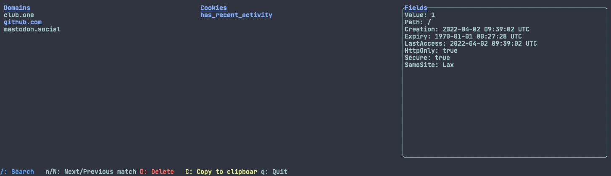

# rokie
A CLI cookie manager for Firefox and Chromium.



The tool was mainly built to gain experience with Rust. Equivalent cleaning
functionality could be attained from a short shell script if one is looking
for a minimal solution.

Currently does not support decryption of the `encrypted_value` field of
Chromium cookies.

## Examples
Interactive view over cookies from a specific file (screenshot)
```
rokie --file cookies.sqlite tui
```
List all cookies from a given domain in a specific browser profile
```bash
rokie --profile "Profile 1" cookies --domain github.com
```
List the domains that have cookies saved across all browsers
```bash
rokie cookies --no-heading --fields Host|sort -u
```
List all fields for cookies from a specific domain
```bash
rokie cookies --domain github.com --fields All
```
Remove all cookies except those from whitelisted domains across all browsers
```bash
rokie clean --whitelist ~/.secret/cookie_whitelist --apply
```

